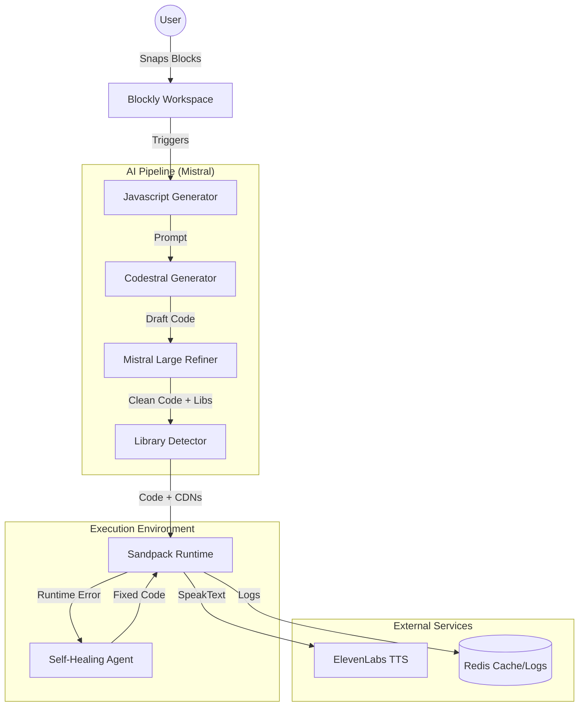

# 🧶 Blockstral: Vibe Coding with Mistral

[](https://opensource.org/licenses/MIT)
[](https://mistral.ai/)
[](https://nextjs.org/)

> **"Traditional coding gives you 'Move 10 steps'. Blockstral gives you 'Make it dance like a jellyfish'—and the AI writes the physics."**

**Blockstral** is an AI-native creative coding platform built for the next generation of creators. By bridging the gap between Blockly's structured interface and Mistral AI's generative power (Codestral & Mistral Large), it enables anyone to build complex interactive worlds using natural language imagination.

---

## 🌟 Key Features

- **✨ AI Magic Blocks**: Describe your ideas in plain English (or Korean!) to generate high-performance p5.js or Matter.js logic instantly.
- **🦾 Self-Healing Core (AI Auto-Repair)**: **System v2.0 Activated.** AI automatically detects runtime errors, captures traces, and refactors code in real-time to fix logic flaws or syntax errors.
- **🎙️ AI Voice (TTS)**: Premium character voices from ElevenLabs. Create sequential dialogues with 4 unique personality styles.
- **🎵 Magic BGM**: AI-driven mood setting. Background music reacts to game states (Tense, Peaceful, Exciting, Mysterious).
- **🤔 AI Mentor**: Ask the AI to explain complex, generated code in simple, friendly terms—perfect for young learners.
- **🕹️ Targeted Physics Control**: Apply professional physics (Gravity, Force, Restitution) to specific entities using visual blocks.
- **💥 Event-Driven Engine**: Built-in HP system, collision detection, and event triggers (e.g., `On Game Start`, `When Clicked`).

---

## 🛠️ Quick Start

The fastest way to experience Blockstral with full persistent logging and caching is via Docker.

### 1. Prerequisites
- Node.js 18+ (for local dev)
- [Docker Desktop](https://www.docker.com/products/docker-desktop/) (Recommended)
- API Keys: [Mistral AI](https://console.mistral.ai/), [ElevenLabs](https://elevenlabs.io/)

### 2. Launch with Docker (Zero-Config)
```bash
# 1. Clone & Setup Environment
cp .env.example .env
# Edit .env with your MISTRAL_API_KEY and ELEVENLABS_API_KEY

# 2. Start Services
docker compose up -d --build
```
Visit [http://localhost:3000](http://localhost:3000) to start creating.

### 3. Local Development
```bash
npm install
npm run dev
```

---

## 📂 Technical Architecture

Blockstral uses a sophisticated AI pipeline to ensure code quality and stability.



### 🧠 The Self-Healing System
When a runtime error occurs (e.g., a sprite is moved before it is created), the **Self-Healing Agent**:
1. Captures the error stack and current code state.
2. Sends a "Heal Request" to Mistral Large.
3. Automatically refactors the code (reordering, fixing syntax).
4. Explains the fix via AI voice and restarts the preview.

---

## 📋 Technology Stack

- **Framework**: Next.js 15, TypeScript, Tailwind CSS
- **AI Models**: 
  - **Mistral Codestral**: Real-time logic and effect generation.
  - **Mistral Large**: Intelligent code review, self-healing, and mentor explanations.
  - **ElevenLabs**: Multilingual v2 high-fidelity character voices.
- **Visuals & Physics**: Blockly (Visual UI), p5.js (2D Canvas), Matter.js (Physics Engine)
- **Runtime**: Sandpack (Browser-based execution)
- **Infrastructure**: Redis (Persistent logs/Cache), Grafana & Loki (Real-time observability)

---

## 🧪 Demo Scenarios

### 1. 🎙️ The AI Storyteller
1. Add `Create Hero Sprite`.
2. Insert `Dialogue Scene`: Hero and System talking about a quest.
3. Add `Magic BGM` (Mood: "Mysterious") + `✨ Style` ("cyberpunk neon city").
**Result:** A professional cinematic intro with AI voice, music, and visuals generated in seconds.

### 2. 🦾 Physics Remix (Healing Test)
1. Add `Apply Force Hero` (Intentional error: Hero doesn't exist yet).
2. Add `Create Hero Sprite`.
**Result:** AI detects the `ReferenceError`, explains that "The Hero must be born before they can be pushed," reorders the blocks internally, and runs the fixed code.

---

## 📜 License

Distributed under the MIT License. See `LICENSE` for more information.

---

**Built with ❤️ for the global community of young coders at the Mistral AI Hackathon.**
