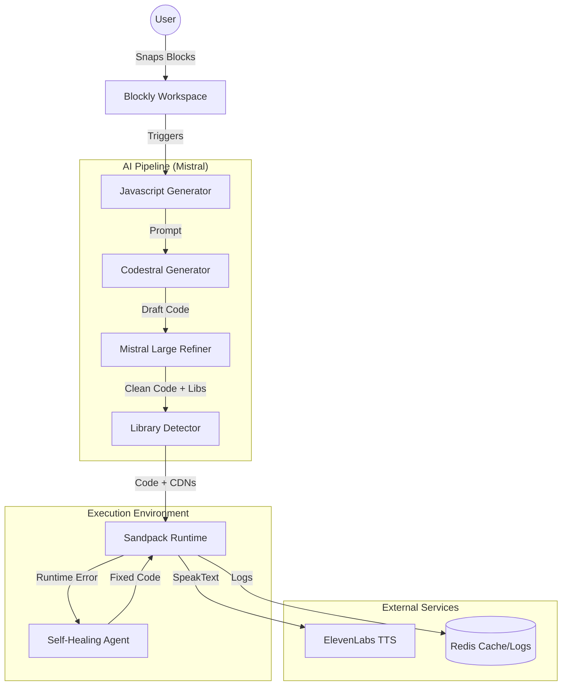

# Software Requirements Specification (SRS)

## Project: Blockstral
**Version:** 1.0 - Mistral Hackathon Final Edition  
**Date:** 2026-03-02  
**Team:** Youngbin0417 & AI Partners  

---

## 1. Vision Statement

> **"Traditional coding gives you 'Move 10 steps'. Blockstral gives you 'Make it dance like a jellyfish'—and the AI writes the physics."**

Blockstral is an **AI-native creative coding platform** that transforms natural language imagination into executable visual logic. By bridging the gap between Blockly's structured interface and Mistral AI's generative power, we enable children to build complex interactive worlds without being limited by pre-defined blocks.

---

## 2. Functional Requirements

### 2.1 AI-Native Block System (FR-BLOCK)

| ID | Requirement | Priority | Implementation Status |
|---|---|---|---|
| FR-BLOCK-001 | **Magic Block (✨)**: Generate p5.js/Matter.js code from natural language prompts. | P0 | ✅ Implemented |
| FR-BLOCK-002 | **Magic Styles**: Apply complex visual themes (e.g., "cyberpunk neon") via AI. | P0 | ✅ Implemented |
| FR-BLOCK-003 | **Magic Condition**: AI-evaluated logic (e.g., "if soul is close to enemy"). | P1 | ✅ Implemented |
| FR-BLOCK-004 | **Remix Code (🧠)**: Refactor or optimize existing code using Codestral. | P1 | ✅ Implemented |
| FR-BLOCK-005 | **AI Voice (🎙️)**: Integrate ElevenLabs for character TTS with custom styles. | P0 | ✅ Implemented |

### 2.2 AI Agent Pipeline (FR-AI)

| ID | Requirement | Priority | Vibe Prompt |
|---|---|---|---|
| FR-AI-001 | **Multimodal Generation**: Use Codestral for logic and Mistral-Large for refinement. | P0 | "Chain two Mistral calls for accuracy" |
| FR-AI-002 | **Self-Healing Core**: Detect runtime errors and auto-fix code order or syntax. | P0 | "Fix 'ReferenceError' by reordering definitions" |
| FR-AI-003 | **Library Auto-Injector**: Detect need for Matter.js or p5.sound and inject CDNs. | P0 | "Scan code for 'Matter.' and add to header" |
| FR-AI-004 | **AI Mentor**: Explain complex AI-generated code in simple English for kids. | P1 | "Translate JS to 8-year-old friendly explanation" |

### 2.3 Game Engine & World (FR-ENGINE)

| ID | Requirement | Priority | Implementation Status |
|---|---|---|---|
| FR-ENGINE-001 | **Physics Engine**: Matter.js integration with Gravity and Force blocks. | P0 | ✅ Implemented |
| FR-ENGINE-002 | **HP & Collision**: Built-in HP system and event-driven damage detection. | P0 | ✅ Implemented |
| FR-ENGINE-003 | **Visual Feedback**: Particle systems (explosions) and custom shape drawing. | P0 | ✅ Implemented |
| FR-ENGINE-004 | **Sequence Dialog**: Sequential character conversations using `async/await`. | P0 | ✅ Implemented |

---

## 3. Technology Stack

- **Frontend**: Next.js 15, TypeScript, Tailwind CSS, Lucide Icons.
- **AI Models**: 
  - **Mistral Codestral**: High-speed logic & effect generation.
  - **Mistral Large**: Intelligent code review, self-healing, and explanations.
  - **ElevenLabs**: Premium AI voices (Adam, Antoni, Josh, Sam).
- **Graphics & Physics**: p5.js (2D Canvas), Matter.js (Physics Engine).
- **Execution**: Sandpack (Browser-based runtime), Custom `runtime.ts` bridge.
- **Infrastructure**: 
  - **Redis**: Persistent log storage and AI prompt/code caching.
  - **Docker Compose**: Unified environment for App and Redis.

---

## 4. Technical Architecture

---

## 5. Key Common Scenarios

### Scenario 1: The AI Storyteller
1. User adds `Speak` block: "Welcome to the neon world."
2. User adds `Dialogue Scene`: Hero and Villain talk sequentially.
3. User adds `Magic BGM`: Mood "Tense".
**Result:** A professional cinematic intro generated with AI voice and music in seconds.

### Scenario 2: High-Level Physics Remix
1. User adds `Create Sprite` "Ball".
2. User adds `Magic Block`: "Make it bounce like a real basketball with spin."
3. AI detects "Matter.js" required, injects it, and sets `restitution: 0.82`.
**Result:** Realistic basketball physics without manually configuring rigid bodies.

---

## 6. Success Criteria

- [x] Zero-config execution via Docker Compose.
- [x] Natural language to p5.js/Matter.js translation (Magic Block).
- [x] AI-driven self-healing of runtime errors.
- [x] High-fidelity audio experience (ElevenLabs TTS & Magic BGM).
- [x] Cyberpunk UI consistency across Blockly and Preview.

---
*Blockstral: Empowering Imagination with Mistral AI.*
